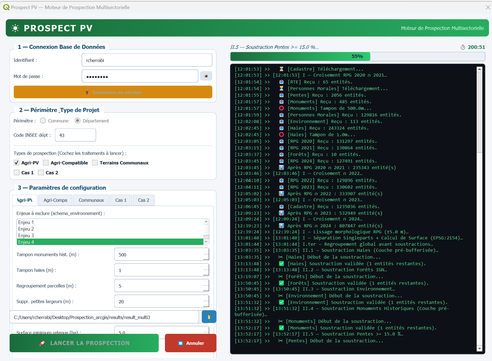

### ☀️ À propos de Prospect PV

**L'objectif fondamental** de cette solution consiste à balayer l'intégralité d'un territoire **départemental** pour en extraire, en un **unique** traitement algorithmique, les parcelles présentant **le plus fort potentiel de développement photovoltaïque**.

En un seul traitement algorithmique, cet outil métier balaye l'ensemble du territoire pour identifier les parcelles les plus propices au développement photovoltaïque. Il centralise l'ensemble des projets (**Agri-PV**, **PV classique**, **terrains communaux**, **zonages d'urbanisme**) au sein d'une chaîne de calcul unique.

---

## 🖥️ Aperçu de l'application

### Console de pilotage PyQt

---

#### 🚀 Ce que fait l'outil en pratique :

* 🗄️ **Croisement exhaustif des données :** interroge directement la base spatiale centralisée pour croiser le cadastre, l'historique du Registre Parcellaire Graphique (**RPG**), le relief (**Pentes**) et la proximité immédiate au réseau de transport d'électricité (**RTE**).
* 🌿 **Filtrage environnemental rigoureux :** écarte automatiquement les servitudes et les zones protégées selon **4 niveaux de sensibilité écologique**, garantissant une détection objective sans risque d'omission.
* ⏱️ **Gain de temps opérationnel :** réduit le délai d'analyse **de plusieurs jours à seulement 1 h à 8 h** par département grâce à la parallélisation des calculs et à l'optimisation des requêtes spatiales.
* 🎯 **Aide à la décision immédiate :** génère une cartographie d'aide à la décision et des listes de parcelles pré-qualifiées enrichies avec les données foncières (personnes morales, SIREN), prêtes pour les démarches de terrain.
